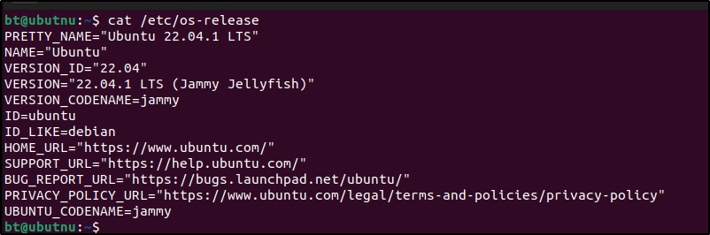
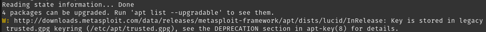
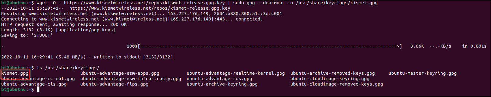
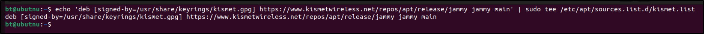
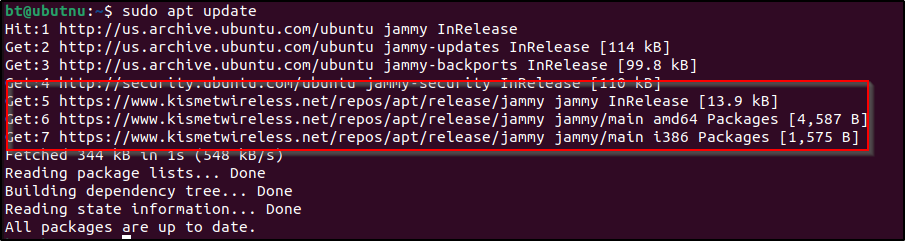
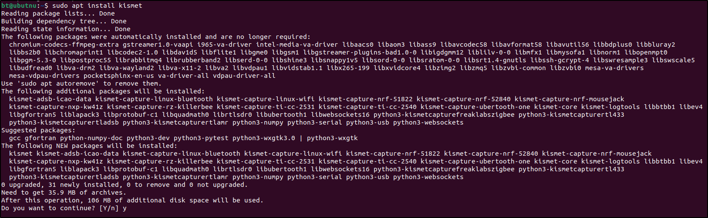

The `apt-key` method of adding gpg keys for repos has been deprecated and will cause a warning message when doing an `apt update`
Using kismets apt source repo I will show you how to take instructions that use the now deprecated apt-key method and change it to use the now supported method for adding repo gpg keys

This is the directions from the kismet site to add their source repo for Debian / Ubuntu based distros I am using a Ubuntu  22.04.1 LTS Virtual Machine for this guide. Although you maybe using a different Debian based distro. The commands to add repos with out apt-key are the same. You just need to use the right repo URLs for your architecture / distro version



The kismet repo instructions for my distro are the following
```
$ wget -O - https://www.kismetwireless.net/repos/kismet-release.gpg.key | sudo apt-key add -
$ echo 'deb https://www.kismetwireless.net/repos/apt/release/jammy jammy main' | sudo tee /etc/apt/sources.list.d/kismet.list
$ sudo apt update
$ sudo apt install kismet
```

Notice the use of the apt-key command this has been deprecated and will lead to the a message similar to the following when doing an `sudo apt update`



To avoid this we will make some changes to how we add the repo to our sources list and to how we add the gpg keys to our system. 

Taking the first line of the kismet directions we have
`wget -O - https://www.kismetwireless.net/repos/kismet-release.gpg.key | sudo apt-key add -`

Since the `apt-key` method has been deprecated, we need to changed this to put the key into its own `.gpg` file that will be stored in the `/usr/share/keyrings/` folder.
The only thing that changes here is we replace `sudo apt-key` with the `sudo gpg --deamrour` command.

`wget -O - https://www.kismetwireless.net/repos/kismet-release.gpg.key | sudo gpg --dearmour -o /usr/share/keyrings/kismet.gpg`

A quick sanity check that it worked by doing an `ls /usr/share/keyrings`



Whew! step one completed we have our gpg key now to take the second line and change how we set up our source list to use the newly saved key

`echo 'deb https://www.kismetwireless.net/repos/apt/release/jammy jammy main' | sudo tee /etc/apt/sources.list.d/kismet.list`

Instead of just echoing our the source url to the tee command to place that in the sources list The command needs to changed to use the gpg key that is saved in keyrings. 
This change is simple we just need to add `[signed-by=/usr/share/keyrings/SOURCEGPGKEY.gpg]` to the echo echo command as follows

`echo 'deb [signed-by=/usr/share/keyrings/kismet.gpg] https://www.kismetwireless.net/repos/apt/release/jammy jammy main' | sudo tee /etc/apt/sources.list.d/kismet.list`



Congratulations you are done the last two commands are just as they are originally.

`sudo apt update`



`sudo apt install kismet`




## Key Takeaways
* Replace `apt-key` with `gpg --dearmour`
* *`gpg --dearmour` ensures that the key is converted to a gpg file format 
* add the `[signed-by=/usr/share/keyrings/key.gpg]` to the source list so apt knows what key is used to authorize the source now that it is not stored in the apt-key list (`/etc/apt/trusted.gpg`)
* if they key is already a gpg formatted key you could just use `sudo tee /usr/share/keyrings/key.gpg` the dearmor command if for converting pgp keys. **There is no harm in using `gpg --dearmor` for every key which is why I used it since it is much more consistent**
*  Also you may notice in the last bullet I said `gpg --dearmor` instead of `gpg --dearmour` while writing this up I learned that both are valid commands *apparently when I originally learned this for my apt-key article on existing repo conversion I got some of my knowledge from someone not located In the US as we always have to do things differently here*  ¯\\\_(ツ)\_/¯
* Enjoy!