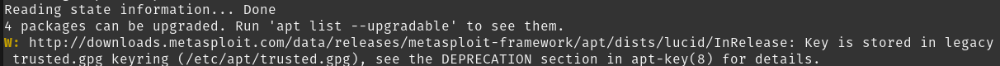
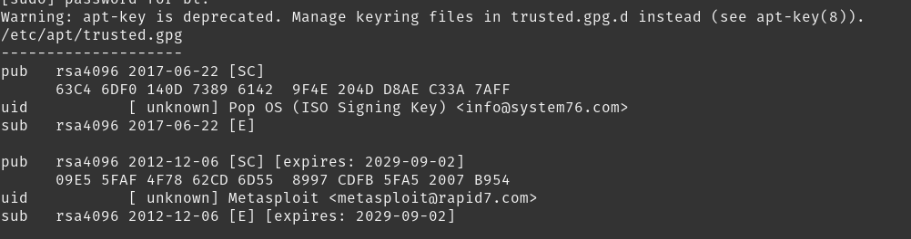
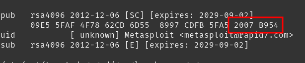
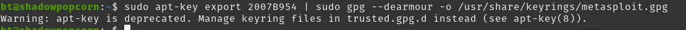
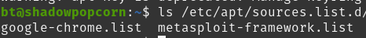
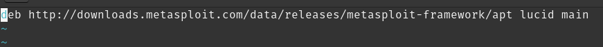
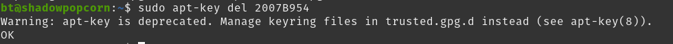

While doing an apt update on my Pop_OS! laptop I received the following message



Looking into it I discovered that the gpg key used to sign the updates as trusted was stored in the trusted.gpg store and has been deprecated, so we need to move the gpg key from /etc/apt/trusted.gpg to /usr/share/keyrings/_APPKEY_.gpg to do this we need to run

``` 
sudo apt-key list
```
This will give you a list of your keys we are looking for the key in the /etc/apt/trusted.gpg section that matches the application source giving us the warning previously



We are looking for the last 8 characters of the public key as seen below


Once we have that we cant export the public gpg key to the keyrings folder using the following command (be sure to update it for your key)
```
sudo apt-key export 2007B954 | sudo gpg --dearmour -o /usr/share/keyrings/metasploit.gpg
```
You can name the key anything you want there just make it something pertaining to the source in this case Metasploit or even Rapid7
this will extract the public key from trusted.gpg and place a copy of it in the /usr/share/keyrings folder

You will get a warning that apt-key is deprecated but as long as you get no other errors you are fine.


Now we need to update the apt source for the repo to use the new key the sources for apt are stored in /etc/apt/sources.list.d/


For me, I am looking for metasploit-framework.list

Open the source in your text editor of choice  with sudo and add the signed-by tag pointing to the key in the keyring folder

original source


In my case, it will look like this

```
deb [signed-by=/usr/share/keyrings/metasploit.gpg] http://downloads.metasploit.com/data/releases/metasploit-framework/apt lucid main
```
Now we can do an apt update and see if the warning is gone, if you don't get the warning then you are all set and we can remove the key from trusted.gpg since it is no longer needed or used.

```
sudo apt-key del 2007B954
```
Remember to use the same last 8 characters you used before.

if you get the OK message it was successful and you are done!

