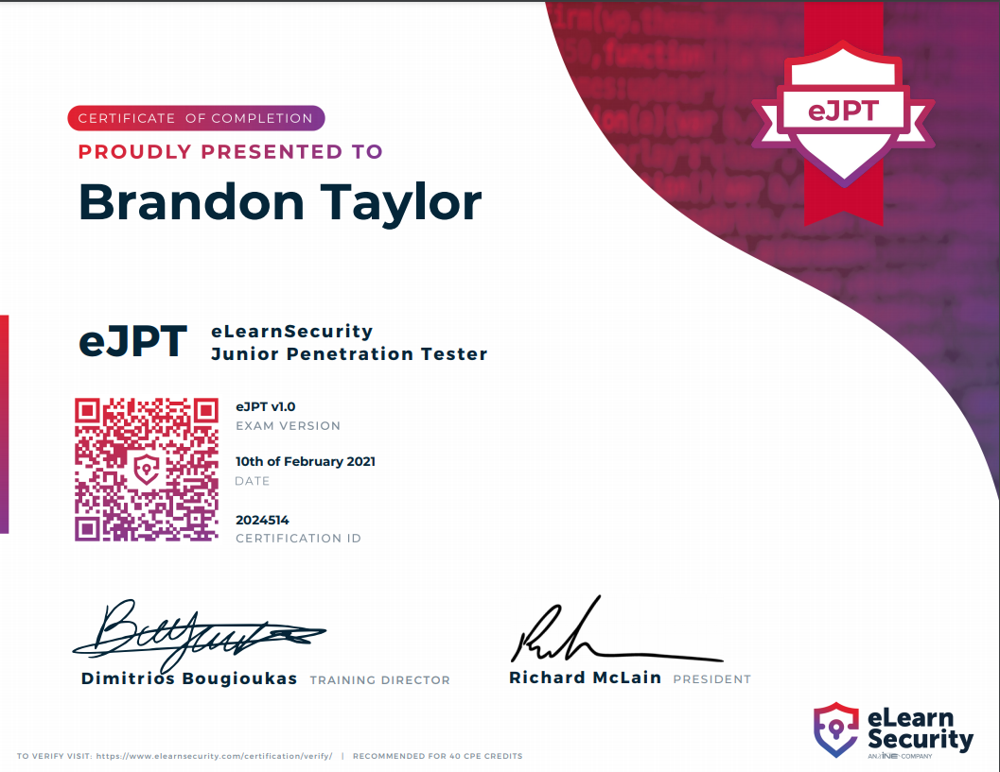

The eJPT certification from INE and eLearnSecurity is awarded to those who pass the exam that is associated with the INE Starter Pass which is a free course you can’t take just for registering a free account with INE (exam not included).

The course is laid out in three parts Introduction, Networking, and Web Applications. The course does a great job of giving you the basics, or a refresher if you are already familiar with basic networking concepts. Having a good understanding of networking will help you on the exam and labs. Also if you have any experience with CTFs like TryHackMe or Hack The Box, that to will help you tremendously throughout the course.

When I was studying for the exam I was worried I would be thrown a curveball that I was not prepared for despite being reading from several people that everything you need is in the course material. Well, they were right everything you need to know is there and then some.

Even though this certification is labeled as a junior penetration tester certification you need to keep in mind that this is not aimed to be a junior or entry-level IT certification. It is more of any entry into the Information Security / Cybersecurity realm, which typically expects you to have a few years of IT experience such as being a System / Network Administration or Developer. Now that is not to say you have to have done that before attempting the exam there are a growing number of people who manage to make the jump right to cybersecurity.

Prior to taking the exam I had read and listened to people talk about the eJPT and describe it as a challenging and fun exam. I found this to be true despite the fact I had moments of being stuck or unsure what I needed to do, I was having fun and didn’t want to give up and take long breaks to reset. You are given 72 hours to complete the exam once you start it and I was able to complete it in around 7 to 8 hours, with short 15 min breaks when I was hitting a wall or needed to get something to eat.

### Tips and Advice

*   Have a Kali VM or dedicated Linux box (I used a Desktop running Pop Os)
*   Be familiar with the Metasploit framework it will make the exam easier
*   Don’t forget there are more protocols than just TCP
*   **TAKE NOTES** trust me it helps
*   When exploring save anything that looks like it might be interesting or useful. It just may be key
*   The black box labs are harder than the exam in my opinion (others have agreed)
*   Take breaks if your hitting a wall remember you have 72 hours to get it done. _YOU GOT THIS!_
*   **Don’t forget to have fun**

I really enjoyed the eJPT exam and the INE Starter Pass (PTSv4) and I hope the other INE exams are just as challenging and as much fun to take because if so I will take the whole library of exams they offer especially since INE just announced their pricing changes. The pricing structure is much flatter and easier to understand now. It is one subscription that gets you the entire INE library starting at $49 USD a month, $499 USD per year, or $749 USD per year for the Premium which is the best value check out the [INE Plans Page](https://ine.com/pages/plans) for the full details of what is included on each level. I am impressed with the offerings that INE has and can’t wait to explore more! 👏