Using mitmproxy in transparent mode is useful for applications that do not accept or ignore proxy settings.

This guide is based on a Ubuntu & Windows Machine the instructions of IP forwarding may differ slightly if using another distro.

### Linux Setup

To enable ipv4 forwarding use the following command

```bash
sudo sysctl -w net.ipv4.ip_forward=1
```

After running the above command you can check to ensure that forwarding is now enable by using the following command

```bash
 cat /proc/sys/net/ipv4/ip_forward
```

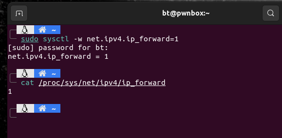

You will also need to forward port 80 and 443 to your proxy, to do this we need to get the interface you want to re route using the ip command

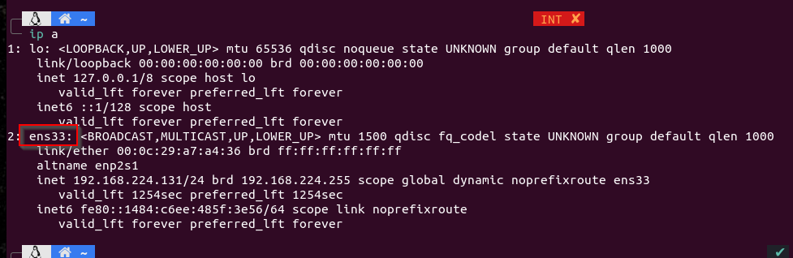

Now that you have the interface you wish to use simply replace the ens33 in the code below with your interface

```bash
sudo iptables -t nat -A PREROUTING -i ens33 -p tcp --dport 80 -j REDIRECT --to-port 8080
sudo iptables -t nat -A PREROUTING -i ens33 -p tcp --dport 443 -j REDIRECT --to-port 8080
```

**Note - this will not persist upon a system reboot**

You will need the IP address of your Linux machine running mitmproxy to set as the gateway on windows

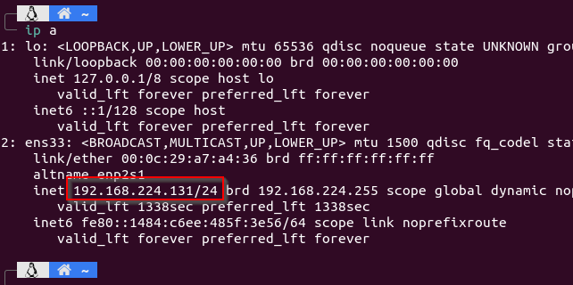

Now you need to run mitmproxy normally to set up the windows side and install the cert when doing this for the first time on a windows machine
```bash
mitmweb
```

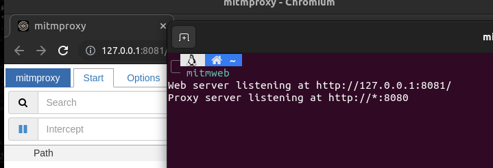

### Windows Setup
On your windows machine you will need to set up the certificate from mitmproxy on your machine just as you would a burp cert for the first time. This is needed so your machine will function properly once we start using the transparent mode.

Configure your windows machine to use mitmproxy as a web proxy

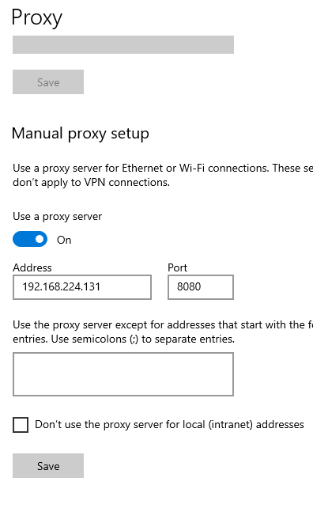

In a browser (Edge or Chrome) visit http://mitm.it to get the cert for windows
**Note - Firefox does not use the windows cert store and should not be used to set up transparent mode**

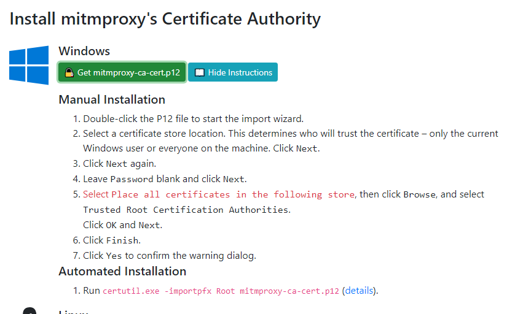

These next steps are for the manual installation of the cert

* click on the cert .p12 file you just downloaded
* for store location select local machine
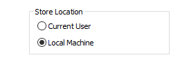
* the downloaded cert should already be listed on the file to import screen (click next)
*  On the private key protection screen leave the password field blank
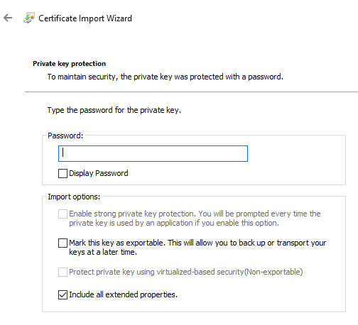
* Certificate Store - choose place all certificates in the following store then click browse
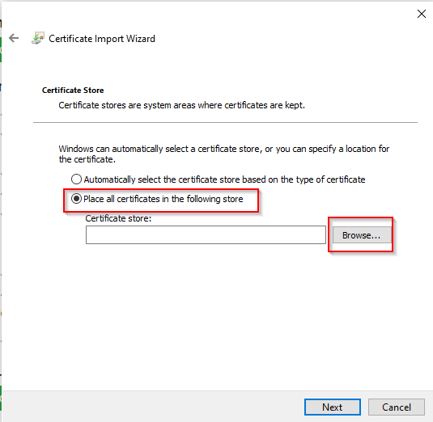
*  Choose Trusted Root Certification Authorities
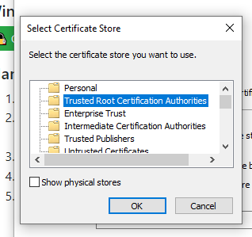
* finish the import

Now that the cert is configured for the system we can turn off the proxy settings

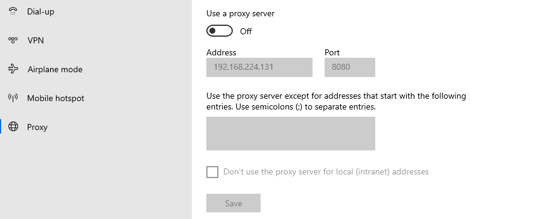

In order for our transparent proxy to work we have to point our Windows machine to use the Linux Machine as our default gateway (since we are not running a DHCP server on Linux we do this manually)

obtain your current IP address in windows and note your current IPv4 address for the correct interface

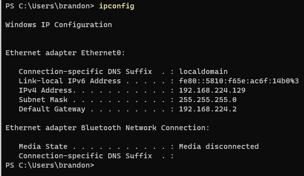

With this information and the IP of our Linux box obtained earlier we can now set up our network interface on windows.

*  IP address should be the IP of your Windows PC
*  The Subnet mask for your IP (most likely 255.255.255.0)
*  Default Gateway - IP of Linux box
*  Preferred DNS - 1.1.1.1

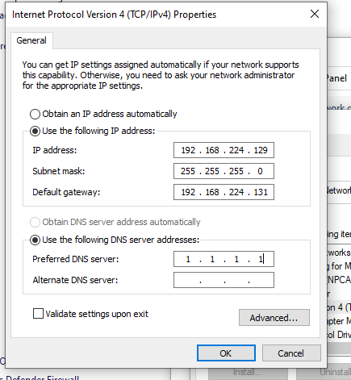


### mitmproxy transparent mode 

Back on your Linux machine stop the current running process for mitmproxy and restart it using the transparent mode flag

```bash
mitmweb --mode transparent --showhost
```

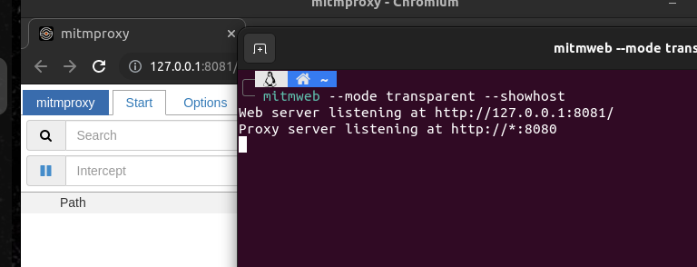

You can now test that internet is working and proceed with your application testing.


additional information is available here - https://docs.mitmproxy.org/stable/howto-transparent/