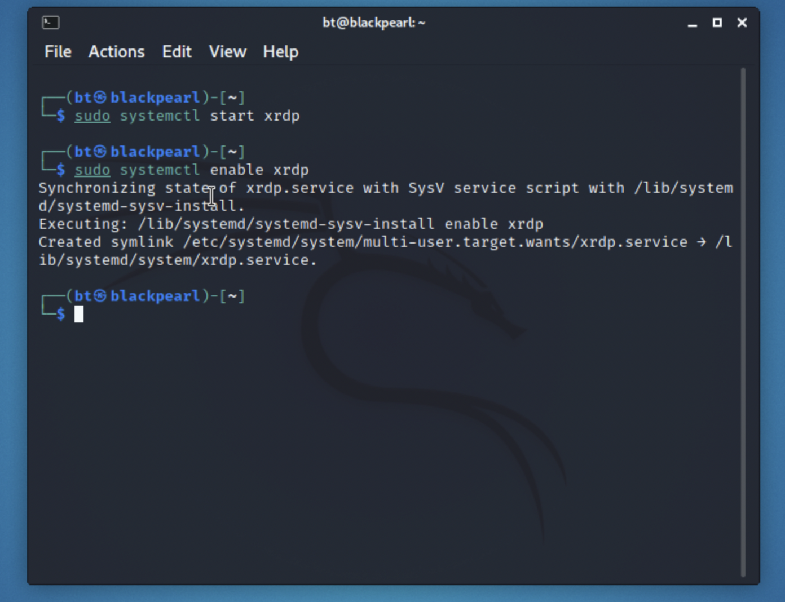

My current personal laptop is a 2020 MacBook Air with the M1 SOC as a result of that choice I do have some limitations or rather some challenges to overcome. One of those being the need to run x86 based applications, this is not of concern as far as Windows goes I can just VPN to my home network and use my Desktop for task requiring x86 based code. However for Linux distros specifically in case Kali Linux, remote desktop or RDP takes a little more to get up and running. In this guide I will walk through enabling RDP on a fresh install of Kali Linux I will assume you already have that set up. My install will be running on my Proxmox server, hence the reason I want to set up rdp the console view that Proxmox gives you does the job but is not the best.

Start by running  
`sudo apt update`

`sudo apt upgrade -y`

Next we need to install the xrdp server  
`sudo apt install xrdp`

Now that we have xrdp installed we need to start and enable it  
`sudo systemctl start xrdp`  
`sudo systemctl enable xrdp`

The start command will start the service right now and the enable command will bring it back up with each reboot

We are now ready to test our work. This is where I got tripped up my first go at this, unlike Windows where if you are logged in already and then remote in from another machine with the same account as what is currently logged in the machine will lock and give control over to the remote session, Linux does not. If you attempt to log in remotely while logged in even if the screen is locked your remote session will just close and wont connect.

With all of that being said once you reboot you can now remote in with no issues.

Great, awesome I can now remote in but what if I kept my remote session open and wanted to login to the physical box what would happen? Well it turns out that if you are logged in remotely and try to log back in physically you can’t, you are just redirected to the username & password screen again and again. However if you were to try to login with a 2nd account that will succeed.

So keep that in mind the next time you try to use rdp with Linux, hope this helped.