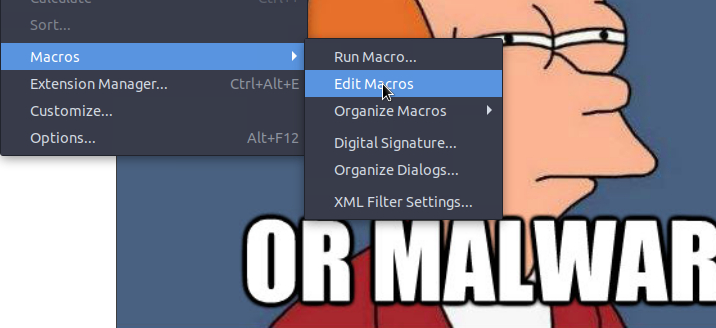
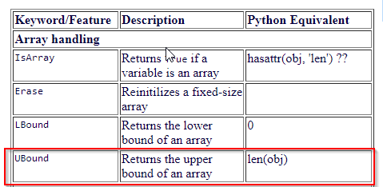
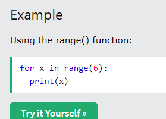
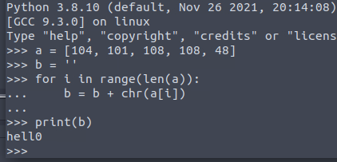

There are numerous tools that allow you to extract the macros from a word document without opening it but since those tools don't exist on this box we will have to open up the document with macros disabled (the default on this box)


Upon opening the document we get a warning that the document has macros and they have been disabled (whew)


To view the macros we need to os to tools > macros > edit macros



From here we need to open the macro so we can begin to figure out what it does
MrPhisher.docm > Project > Modules > NewMacros


From here we get our first looks at the macro's code 


I am going to use python to reverse engineer this code and figure out what it does. We will start with the array let's make this an array formatted for python open up a terminal window and open python

```
ubuntu@thm-mr-phisher:~$ python3
```

In python, arrays are enclosed in square brackets []


From the macro source, we see that they have defined an array called a and a string called b. Since we have already set up our array we need to create a string as well we will call it b to keep it simple.


from here it appears that the macro starts a for loop initializing I to 0 and going up until UBound(a)


I am unaware of what UBound() is in vba script so a quick google search reveals the answer.


Python does not have a UBound function so some more research on python ubound gets me a result for this site that shows the python equivalent of vba functions
[http://vb2py.sourceforge.net/keywords.htm](http://vb2py.sourceforge.net/keywords.htm)



Awesome so Ubound in python is the length of an object so in this case 
```
len(a)
```

Now that we have that we can start our for loop if you are not familiar with python for loops there are a lot of great resources out there such as [W3 Schools](https://www.w3schools.com/python/python_for_loops.asp)

We will be using a for range loop as it matches the for loop from our macro code



We will need our range to go from 0 to the length of our array


Next, we need to tear apart what is happening within the loop


It looks like we are taking b and making it equal to everything already in b and the result of
```
Chr(a(i) Xor i)
```
Breaking down this bit of code we are casting (converting) the result of XORing our array at the index of i against i

Assuming you don't have a lot of experience with arrays and indexing them. Let's detour and take a look at this simple example 

```
a = [104, 101, 108, 108, 48]
```
if i is set to 0 in our loop and we call 

```
a[i]
```
this is the same as saying

```
a[0]
```

this will return to us the first item in our array in this case 104

if we converted that to a chr (character)

```
chr(a[i])
```
we would get back the character equivalent of the number 104 which is a lowercase h in this case. to get more in depths check out the ascii chart

If you finish converting the array by looping over it as follows.



Ok now that the sidebar is over and we have a better understanding of how arrays work and how to convert to a chr we can better understand what is happening in our macro.

The macro is taking a[i] and XORing it against i then converting that to a chr and storing it in b along with everything else that was already contained in b to give us a final string.

**For a great explainer on xor check out this [Gary Explains Video](https://www.youtube.com/watch?v=3Kvv7VEM3uc) he does a way better job than I could in this format.**

So we will do the same but first, we need to know how to xor in python. In python, the xor operator is the carrot symbol (^)


don't forget the tab (or spaces) at the beginning since whitespace is important in python. At the end of the line hit enter twice and it will exit the for loop
now we can just print our string to figure out what the macro does (in this case our flag)


If you prefer to not use the python interpreter and would rather write your code into a text file (.py) to run it should look like this.

```
a = [102, 109, 99, 100, 127, 100, 53, 62, 105, 57, 61, 106, 62, 62, 55, 110, 113, 114, 118, 39, 36, 118, 47, 35, 32, 125, 34, 46, 46, 124, 43, 124, 25, 71, 26, 71, 21, 88]
b = ''

for i in range(len(a)):
    b = b + chr(a[i] ^ i)
print(b)
```
I saved my example as macro.py. You can then call it by calling python3 macro.py 


I hoped this helped you learn something. This was my first time analyzing a word macro before and it was definitely fun. If this interests you, I suggest checking out [John Hammond's YouTube](https://www.youtube.com/c/JohnHammond010) his videos really helped me understand the thought process when it comes to reversing macros and malware, which led to me being able to accomplish this task and complete this room.

[https://tryhackme.com/room/mrphisher](https://tryhackme.com/room/mrphisher)