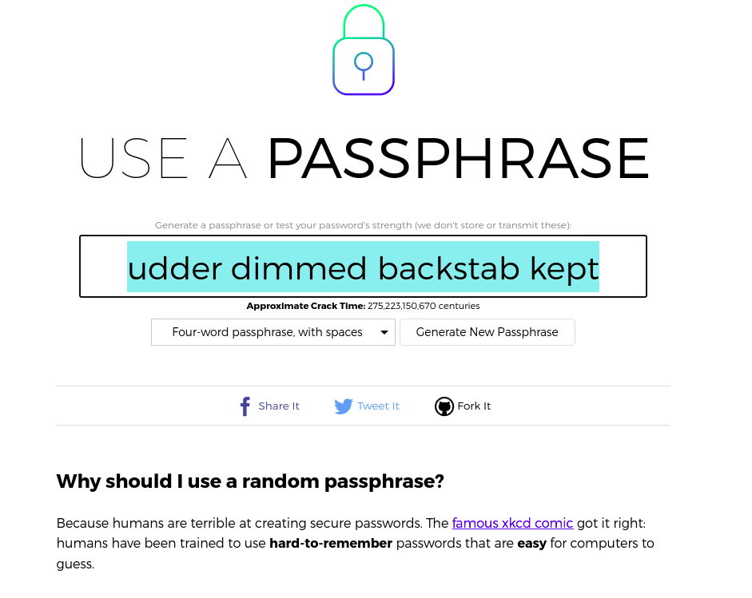
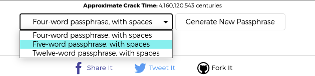

I have recently begun looking at some of the security policies in orgs especially pertaining to passwords. I noticed that typically passwords have to be at least 8 characters and contain a mix of upper and lowercase, numbers, and special chars, but all of those are not required in all environments. In addition to that passwords are set to expire every 3 months. Some environments take this a step further and will remember your last X amount of passwords, this prevents you from using the same few passwords on a cycle. Say this number is 10, any of the last 10 passwords you have used can not be used again this leads to users having a list of 11 passwords they cycle through when they hit number 11 they will start back over at 1 when that dread password reset time comes calling. While this may have been sufficient in the past that is not the case anymore. Almost daily it seems there is a new breach and leaked credentials are everywhere I am willing to bet that there are users in a majority of orgs that have a password that has been involved in a leak as their password today. This has led me to a new idea I purposed to some end users to get a feel of how it would be received by them.
Before I dive into how I presented my proposal to the users here is the policy I was going to present 
- A minimum of 20 characters
- passwords change once every 12 months
- the only exception is for passwords that show up in database leaks these must be changed immediately 
- leaked passwords are on a banned list

Now when I first presented this to users I led with the following.

"What if I told you your passwords going forward have to be 20 characters or longer how do you feel about that?"

I received responses ranging from extremely unhappy to, ok what other choice do I have. Not one user was thrilled with the proposal as to be expected.
I then elaborated on this by explaining the trick was to use passphrases. Passphrases are sentences that are easy to remember or even just strings of random words. Some examples of sentence passphrases are as follows

- walking in the park is very relaxing
- I love to sleep in on Sundays!
- The CyberSecurity dept made me have this long passw0rd!

Some examples of a string of words are as follows thanks to [useapassphrase.com](https://www.useapassphrase.com/)

- reformist bankbook kennel swoop
- coming pyramid hence silo grew
- unfocused cancel sulfite starch sulfite
- dumpster glitch routing triumph aspire saddled eligibly magnitude sauna dexterity fax rifling

This site allows you to randomly generate passphrases using four words with spaces, five words with spaces, or twelve words with spaces.

This made the new revelation that you could hit 20 characters without having a password that looks like it was created by banging your head on the keyboard made them much more accepting of the purposed change, but not yet fully on board. What sold every single user I polled on this idea was the addition of the update to the password expiration portion of the policy. When I informed the users that under this new password policy they would not have to change their password every 3 months but one time a year except for leaked passwords, every single one of them was completely on board with this a few of them were excited and said: "Heck yeah sign me up!"

This purposed policy change makes your user accounts much more secure since they can easily remember the password (thank you passphrases) and will be less likely to write it down somewhere. It also increases the complexity for brute-forcing passwords making the time to crack much much higher than an 8 character password and with today's GPUs we need to increase this as an 8 character password doesn't stand a chance against a cluster of GPUs. Add in multi-factor authentication for your users which you are already using... right?, and you have just increased the security of your org without causing riots and angry protests of the Cybersecurity and IT departments. 